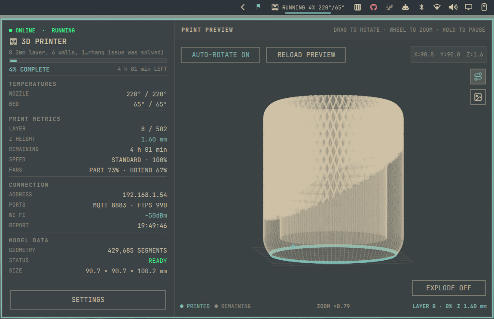

# Bambu Companion for Omarchy Quattro

<p align="center">
  
</p>

> [!IMPORTANT]
> **FTPS transfer speed:** FTPS transfers on Bambu Lab printers (such as the P1
> and A1 series) are slow because of hardware limits in the built-in ESP Wi-Fi
> module and SD card I/O speeds. The processor is designed for low-power tasks,
> not heavy data transfers.

Monitor a Bambu Lab printer from the Omarchy Quattro bar. Bambu Companion
shows live print telemetry, the slicer's 2D plate preview and a lightweight,
interactive wireframe extracted from the sliced G-code.

## Install

```bash
omarchy plugin add https://github.com/ypMrg/omarchy-bambu-companion.git --enable
```

On first launch, the plugin installs its locked Ruby dependencies in an
isolated user-data directory. System gems are never modified. Internet access
is only required for this initial dependency installation.

Update or remove the plugin with:

```bash
omarchy plugin update io.github.ypmrg.bambu-companion --yes
omarchy restart shell

omarchy plugin remove io.github.ypmrg.bambu-companion
```

If the widget is enabled but not present in the bar, place it explicitly:

```bash
omarchy plugin enable io.github.ypmrg.bambu-companion --section right
omarchy restart shell
```

## Setup

Open the bar widget to configure a printer. The panel stays closed across
plugin reloads and when other plugins are added. A connection loader remains
until the first fresh status report is received; only then does the live
dashboard appear.

1. Enable local network access on the printer and obtain its serial number and
   LAN access code from the printer's network settings. On firmware that offers
   **Developer Mode**, enable it so third-party clients can use the local MQTT
   and FTPS services.
2. Open the Bambu Companion widget.
3. Enter the printer address, serial number and LAN access code.
4. Select **Save & Connect** to check the printer certificate. No LAN code is
   sent during this check.
5. Review the SHA-256 identity shown for MQTT and FTPS, then select
   **Trust & Connect** to approve it and start the authenticated connection.

Use a trusted local network for this first approval. Existing installations
without saved certificate identities must approve their printer once after
updating; later connections are automatic while those identities remain the
same.

The exact printer menu names and local-service requirements vary by model and
firmware. LAN Only Mode and Developer Mode are separate settings on printers
that provide both. Current firmware can require Developer Mode to expose MQTT
and FTPS to unsupported third-party clients; without those services the plugin
cannot connect. Bambu describes this mode in its
[third-party integration update](https://blog.bambulab.com/updates-and-third-party-integration-with-bambu-connect/)
and notes that the exposed protocols are not officially supported APIs.

This plugin connects directly to the printer. It does not connect to Bambu
Cloud or implement Bambu Connect authorization.

### Configuration

| Setting | Default | Description |
| --- | --- | --- |
| Printer name | `3D Printer` | Name displayed in the dashboard |
| Printer address | — | IPv4, IPv6 address or hostname |
| Serial number | — | Printer serial used by MQTT topics |
| MQTT TLS port | `8883` | Local encrypted telemetry service |
| FTPS port | `990` | Local implicit-FTPS file service |
| MQTT / FTPS username | `bblp` | Local Bambu service account |
| LAN access code | — | Password shown by the printer |
| Wireframe segment limit | `500000` | Detail cap, 1,000–1,000,000 |
| Explode factor | `100` | Additional vertical layer-spacing factor, from 0 to 500 |
| Auto-rotate by default | enabled | Initial rotation state when the viewport loads |
| Bar summary | enabled | Show or hide status, progress and temperatures in the bar |

The plugin uses the current Omarchy theme accent for non-semantic highlights.
The **Bar summary** toggle is applied immediately.
The bar icon is green only while the printer is in the temporary finish state,
red on fail or error, and otherwise uses the default bar color. Recap KPIs in
the bar always use the default color.
Other configuration changes are applied with **Save & Connect**.

Settings and the live dashboard reflow at narrow widths so every control stays
inside the panel margins.

When a code is already available, Settings reports whether it is stored in
GNOME Keyring or active only for the current session. Leave the code field
blank to keep it, enter another code to replace it, or use **Forget code** to
remove it.

**Disconnect printer** asks for confirmation, then removes the printer address,
serial number, trusted certificates and LAN code. It preserves the printer
name and visual preferences so the plugin is ready for a new connection.

### Desktop app and launcher

Select **Open app** at the bottom of the widget panel to move the dashboard
into its own window. It is a normal Wayland application window, so Hyprland
tiles, focuses, resizes and moves it between workspaces like other Omarchy
apps. The window and bar panel share one background printer session; opening
both does not create a second MQTT or FTPS connection.

The launcher entry is opt-in. In **Settings → Desktop**, select **Add to app
launcher** to install a standard per-user desktop entry and icon. Bambu
Companion will then appear in the Omarchy launcher as an application. Use
**Remove from app launcher** before removing the plugin if you no longer want
the entry. Neither installing nor updating the plugin changes the app launcher
without this explicit action.

The **Application** section at the bottom of the information sidebar shows the
running plugin version. It checks the git-managed installation for a newer
manifest version at startup and every six hours. When an update is available,
select the download icon to run Omarchy's native non-interactive plugin update;
the shell then reloads the validated plugin. Manual installations that are not
git checkouts continue to show their current version without an update action.

## Features

- Compact bar icon with optional status, progress and temperature summary.
- Full dashboard in a normal, resizable tiled application window.
- Optional Omarchy launcher entry managed from the plugin's Settings view.
- Live connection, print state, progress and remaining-time reporting.
- Current and target nozzle/bed temperatures.
- Current layer, total layers and exact or estimated Z progress.
- Speed profile, fan speeds, Wi-Fi signal and last report time.
- Landscape dashboard with telemetry on the left and print preview on the right.
- Selectable slicer image and sliced G-code route when available.
- Animated exploded G-code layers with a configurable spacing factor.
- Animated simulated nozzle marker on the current G-code layer.
- Configurable accent color and wireframe detail limit.
- Automatic reconnect after temporary network loss.
- Monitoring-only operation: no pause, resume, stop, upload or speed commands.

After a completed print, `FINISH` remains visible for 60 seconds and then
settles to `READY`. Starting another job cancels that delay immediately.

## Print preview

When a job starts, the backend identifies its print file and downloads it over
FTPS. For a sliced 3MF archive it reads the bounded PNG plate preview and the
recognized outer-wall moves from the embedded G-code. Direct `.gcode` files
provide only the route view.

On newer printers and firmware, including current H2D, H2S and P2S releases,
jobs kept only in internal storage may not be visible over FTPS. To use print
previews on those printers, enable **Store Sent Files on External Storage** in
the printer's print options and keep the appropriate USB drive or SD card
installed. If the active file is not exposed, live MQTT telemetry continues but
the Image and Route previews remain unavailable.

The loading view distinguishes SD-card lookup, FTPS transfer, and local G-code
processing. When the printer reports the remote file size, the FTPS phase shows
a byte count and a determinate progress bar; extraction and parsing remain
indeterminate. Large sliced archives can therefore be slow even though MQTT
telemetry itself is already connected.

The **Route** and **Image** icon buttons are always visible below the coordinate
badge. A source that is unavailable is disabled. The 2D image is selected by
default when G-code is unavailable; otherwise the G-code route is selected.
Switching views preserves the G-code camera.

A new print starts a new preview generation, so late data from the previous job
cannot replace it. The downloaded file is private and temporary, and is removed
immediately after parsing, cancellation or failure.

During printer calibration, heating or file preparation, print data may not be
available yet. The plugin explains this state and retries automatically. Use
**Reload preview** to request another attempt manually.

Preview controls:

| Input | Action |
| --- | --- |
| Drag horizontally | Rotate around the model |
| Drag vertically | Inspect from above or below |
| Hold the pointer | Pause automatic rotation |
| Mouse wheel | Zoom from `0.50×` to `4.00×` |
| Route / Image icons | Select an available preview source |
| Auto-rotate | Enable or disable continuous rotation |
| Explode | Animate additional vertical spacing between G-code layers |

Printed paths use the configured accent color; remaining paths stay subdued.
While printing, a small animated point loops over the outer-wall segments of
the nearest current layer. It gives the route visual motion; it is not the
printer's real-time nozzle position. The route is drawn on the GPU, so
auto-rotate and drag show every stored segment. If the renderer is compiling
or cannot be built, the route view stays empty (`COMPILING ROUTE RENDERER`)
and the 2D preview remains available.

### Supported print files

- Direct `.gcode` files.
- Bambu Studio or OrcaSlicer `.gcode.3mf` files.
- Unambiguous `.3mf` archives containing `Metadata/plate_*.gcode`.
- Bambu 3MF plate previews such as `Metadata/plate_*.png` and the standard
  auxiliary thumbnails.
- Outer-wall markers produced by Bambu Studio, OrcaSlicer,
  PrusaSlicer/SuperSlicer and Cura.

An invalid or missing image does not disable valid G-code, and unsupported
G-code does not hide a valid image. MQTT status monitoring continues normally
when neither visual source is usable.

## Printer compatibility

Bambu Companion has been live-tested only with a Bambu Lab A1 Mini. The table
below records expectations from the shared Bambu LAN protocols and file
formats; it is not a hardware test matrix or a compatibility guarantee.

| Printer family | Expected support | Important limitations |
| --- | --- | --- |
| A1 Mini | Live-tested | Compatibility can still change with firmware updates |
| A1 | Expected | Uses the same basic telemetry and file conventions; not live-tested |
| P1P / P1S | Expected | Core monitoring should work; print preview has not been live-tested |
| X1 / X1C / X1E | Expected | Core monitoring should work; print-file availability and preview timing can vary |
| A2L / P2S / H2S | Experimental | Core monitoring is expected; newer storage behavior can prevent previews |
| H2D / H2C / X2D | Experimental | Basic monitoring is expected, but dual-nozzle telemetry and toolpaths are only partially represented |

Larger build volumes are not inherently a problem: the viewport derives its
bounds from the active G-code rather than assuming an A1 Mini bed size.
Model-specific features are a separate limitation:

- The dashboard reads the common single-nozzle temperature fields. On
  dual-nozzle printers it does not display both nozzles independently.
- The G-code route parser does not track dual-tool state, so H2D, H2C and X2D
  route accuracy has not been verified.
- Chamber temperature, active chamber heating, door state, additional fans,
  air-duct state, AMS details and other model-specific telemetry are not shown.
- Laser, cutting and plotting jobs are outside the plugin's scope. Bambu also
  prevents Developer Mode from being used with laser and cutting functions on
  applicable H2 printers.

Every printer must expose local MQTT and implicit FTPS and provide a LAN access
code. A successful MQTT connection confirms only telemetry compatibility; it
does not guarantee that the active print file is accessible for Image or Route
previews. Firmware can change these undocumented interfaces independently of
the plugin.

## Security and local storage

- The plugin does not overwrite user configuration without explicit consent:
  printer settings are written only with **Save & Connect** or
  **Trust & Connect**, cleared only after confirming **Disconnect printer**, and
  the bar-summary preference changes only when its toggle is changed. The
  desktop entry is installed or removed only with its Settings action.
- The LAN access code is never stored in plugin settings, the repository,
  process arguments or normal logs.
- `secret-tool` stores the code in GNOME Keyring when available. Otherwise it
  remains only in the current backend process memory.
- The code is passed to the Ruby backend and GNOME Keyring through standard
  input, not command-line arguments.
- Downloaded G-code/3MF files use private temporary files and are deleted after
  parsing, cancellation or failure. No source print-file cache is kept.
- The bounded PNG preview travels over JSON. The simplified toolpath is written
  atomically as a private packed `float32` file and loaded directly by the GPU
  renderer, avoiding a second 500,000-row JavaScript copy. The route respects
  the configured segment limit; connected moves are merged when simplification
  is required so contours remain continuous. Both sources are replaced
  atomically by the next preview generation.
- Bambu printers use local self-signed certificates, so the plugin applies
  explicit trust on first use instead of relying on a public certificate
  authority. It records independent SHA-256 certificate identities for MQTT
  and FTPS only after **Trust & Connect**.
- Every authenticated MQTT and FTPS TLS connection must match its saved
  identity. If either certificate changes, the plugin blocks reconnecting and
  requires a new explicit review; it never replaces an identity automatically.

## Requirements

- Omarchy Quattro v4.
- Printer and Omarchy machine reachable on the same trusted network.
- Local printer access and a valid LAN access code.
- `ruby`, `gem`, `flock` and GNU `readlink`.
- `secret-tool`/GNOME Keyring recommended for persistent secret storage.
- `cmake` and `g++` are needed to compile the G-code route view. The rest of
  the plugin works without them.

The launcher installs the exact Bundler version from `Gemfile.lock` when
`bundle` is unavailable, then installs all locked gems under the plugin's
private data directory.

## Troubleshooting

### The widget is missing

```bash
omarchy plugin list --json
omarchy plugin enable io.github.ypmrg.bambu-companion --section right
omarchy restart shell
```

### The printer remains offline

- Verify the address, serial number, ports, username and LAN access code.
- Confirm that local printer access is enabled and both devices share a LAN.
- Replace the saved code if the printer generated a new one.
- Check that a firewall is not blocking TCP ports `8883` and `990`.
- If a certificate-change warning appears after a printer reset or firmware
  change, confirm that the address still targets your printer before approving
  the new SHA-256 identity.

### The preview is unavailable

- Wait while the printer finishes calibration, heating and file preparation.
- Confirm that a supported G-code or 3MF file is present on the printer.
- Select **Reload preview** after the print has entered `RUNNING`.
- Status monitoring remains usable even when preview extraction fails.

### Inspect Quickshell logs

```bash
journalctl -t omarchy-shell -b --no-pager \
  | grep -Ei 'bambu|plugin widget|failed|error'
```

## Development and validation

Run all local checks from the repository root:

```bash
bin/test
```

This verifies the production bundle, Ruby and shell syntax, high-signal
RuboCop and ShellCheck rules, JSON/QML contracts, launcher isolation, parser
behavior and GPU projection math. `minitest`, `rubocop`, `shellcheck`,
`qmllint` and Node.js are development only; none is a runtime dependency of
the installed plugin. Node.js is required for extracted QML JavaScript tests
and `g++` is required for projection tests.

Validate a checkout inside Omarchy Quattro with:

```bash
omarchy plugin validate "$PWD"
bin/test
```

For an unpublished checkout in a disposable Quattro VM:

```bash
plugin_target="$HOME/.config/omarchy/plugins/io.github.ypmrg.bambu-companion"
test ! -e "$plugin_target"
mkdir -p "$plugin_target"
cp -a -- "$PWD/." "$plugin_target/"
omarchy-shell shell rescanPlugins
omarchy plugin enable io.github.ypmrg.bambu-companion --section right
omarchy restart shell
```

## Architecture

- `BambuWidget.qml` and the smaller QML components implement the bar,
  dashboard, settings and GPU `GcodeRoute` item compiled into the user data
  directory.
- `daemon.rb` launches the Ruby backend.
- MQTT provides printer telemetry; implicit FTPS provides the active print
  file.
- Ruby parsers retain a bounded PNG plate preview and streamed, downsampled
  outer-wall G-code.
- Newline-delimited JSON over stdin/stdout carries control, telemetry and
  preview metadata between the isolated backend and Quickshell. Large G-code
  geometry uses the private packed `float32` file announced by that protocol.

The current release supports one printer. Multi-printer dashboards, camera
streams, cloud access and printer-control actions are intentionally excluded.

## License

[MIT](LICENSE) — Copyright (c) 2026 Matthieu G.C.

Bambu Lab names and trademarks belong to their respective owners. This project
is independent and is not affiliated with or endorsed by Bambu Lab.
